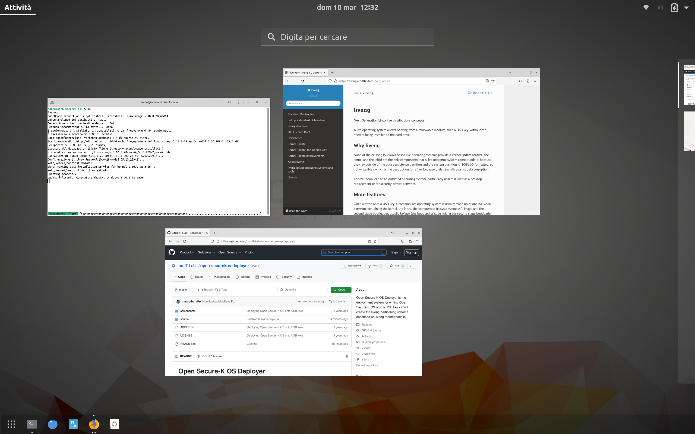
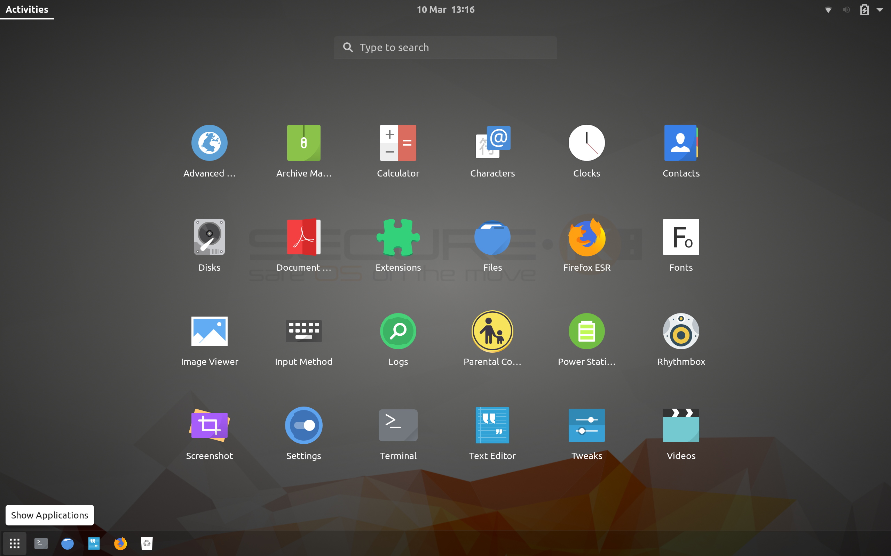

Open Secure-K OS
================

What is
^^^^^^^

    **Open Secure-K OS** is an operating system booting from a USB key in which you can safely create and store your personal and private data. It is an **advanced Debian Bullseye Linux-based live USB operating system built for security**: user and system data are saved encrypted within the USB key (AES 512bit), so the system can be used as a clean and safe environment for your on-line security-critical activities. Moreover Open Secure-K OS does not rely on the PC hard drive and, being a Linux derivative, it’s immune to most viruses and it’s spyware / adware / backdoor free.

    Open Secure-K OS features a unique partitioning scheme - it is liveng-compliant (https://github.com/LumIT-Labs/liveng, https://liveng.readthedocs.io) -, which allows complete system and kernel update with a readonly system partition. See the liveng specification or below for more.

    Unique system features are:

    * native encrypted persistence;
    * **kernel update** (**on a ISO9660 filesystem**, which is the best option for a live operating system because of its strength against data corruption and tampering);
    * UEFI boot with a real efi partition (this new release is not more Secure Boot compliant; this might change - again - for the next release);
    * user creation wizard upon the first boot. 

     None of the existing ISO9660-based live operating systems except Open Secure-K OS provides a kernel update feature.

    At the end of the day, Open Secure-K OS is thought as a **the most solid and secure base for your own live operating system** - you can customize it at your will (only the very basic programs are installed by default).

Screenshots
^^^^^^^^^^^

How to use
^^^^^^^^^^

An already-built initial ISO image can be found in Releases (https://github.com/LumIT-Labs/open-securekos/releases).

**Open Secure-K OS Deployer** (https://github.com/LumIT-Labs/open-securekos-deployer) is the deployment system for writing the initial Open Secure-K OS ISO image onto a USB key - it will create the liveng partitioning scheme. 
Install the Deployer (you need a Debian based operating system for this), run it, select the downloaded image and type in a passphrase of your choice for LUKS-encrypting the data persistence partition (remember: Open Secure-K OS features native encrypted persistence), then click on Write. 

Once write is finished, you can boot your computer with the USB key. **Secure Boot must be disabled on the PC BIOS settings for the operating system to boot**.

During the boot you will be asked for the decryption password of the data persistence partition - the secret you enter while deploying.

Technical (and interesting?) notes
^^^^^^^^^^^^^^^^^^^^^^^^^^^^^^^^^^

The partitioning scheme is made up of two ISO9660 system partitions, one containing all the “interesting” files for a live operating system (kenel, initrd, filesystem.squashfs) and the other one containing kernel and initrd only.

The GRUB bootloader (both for BIOS and UEFI) is instructed to boot by default from the second system partition, because that one always contains the most updated kernel and initrd files: at every kernel update, this small partition will be overwritten.
Open Secure-K OS differs from the LumIT Labs’ liveng definition in the way the readonly second system partition is rewritten: a hook is called at every initramfs update and not only within a kernel package’s postinst.
First System partition files are kept at their default state and can be useful in case of recovery or when a complete persistence reset is performed.

The third (FAT) partition is for the UEFI compliance (it contains the UEFI GRUB bootloader); the first-stage BIOS GRUB bootloader is installed within the (protective) MBR.

Data persistence is accomplished by a fourth partition where system is instructed to write into, or better explained, whose filesystem will be union-mounted with the filesystem.squashfs image's filesystem. 
This can be optionally LUKS-encrypted. 

Normal flow is:
 - GRUB boots the kernel/initrd from the second partition, then union mounts the filesystem.squashfs (within the 1st partition) with the persistence partition and this will be the root /.
 - First partition is used for storing the filesystem squashfs and the original kernel. 
 - Why not storing the filesystem.squashfs within the second partition? Because we need to rewrite it at every kernel update, so it must be very small. 

How to build the initial ISO image
^^^^^^^^^^^^^^^^^^^^^^^^^^^^^^^^^^
This section is for developers who want to contribute to the project.
A **Debian Bullseye** host/vm is required for the build; other Debian-derived systems may work.

The Open Secure-K OS ISO image is built using the standard Debian **live-build** framework, so you first need to install it::
 
    apt install -y live-build

Git **clone this project as root**.

In order to build a Secure-K OS image, open the terminal emulator **as root**::

    cd /path/to/open-securekos/live-build

    lb clean
    lb config
    lb build

A .iso image will be built according to your host architecture.

